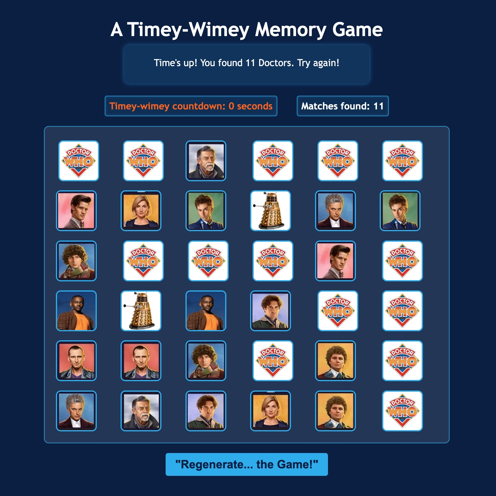

# 🌀 **Doctor Who: Memory Card Game** 🌀  

_A timey-wimey test of memory through all of time and space!_  

  

---

## 🕹️ About the Game  
**Doctor Who: Memory Card Game** is a **browser-based memory matching game** where players flip over cards to find matching pairs of **all the legendary Doctors** who have played the role of The Doctor in the hit TV series, _Doctor Who_.  

The task? **Match as many Doctors as you can before time runs out!** But beware—Time slips away quickly! 🚀🌀  

---

## 🎭 Background  
I was introduced to **Doctor Who** by my son, and through him, I became a **huge fan**! This is also the first game I played with my grand-daughter, I wanted to create a game that brings together family, **coding and all things Doctor Who!**  

This is my **first project for Adobe Digital Academy**, where I am refining my **JavaScript skills, game logic, and DOM manipulation techniques**. Through this project, I learned how to manage **game state, handle timing functions, and dynamically update the UI** while creating an engaging user experience.   

---

## 🚀 Getting Started  
🔗 **Play the game here:** [Doctor Who Memory Game](https://angellsworth.github.io/project-one-memory-game/)  

### 🎯 How to Play:  
1. Flip cards to reveal **Doctor Who characters**.  
2. Find and match **two identical Doctors**.  
3. **Match all pairs** before the **timer reaches 0** to win.  
4. Click **Reset** to shuffle and play again.  

---

## 🛠️ How the Game Works  
1️⃣ **Cards are shuffled** using CSS `order` to visually randomize cards.  
2️⃣ **Clicking a card** flips it over.  
3️⃣ **Timer starts** when the first card is flipped.  
4️⃣ **If two cards match**, they stay flipped.  
5️⃣ **If they don’t match**, they flip back after 1 second.  
6️⃣ **Game Ends When Time Runs Out** – Your final score is how many doctors you matched.  

---

### 🔄 Shuffle Method  
The game shuffles the cards by **randomly assigning each card a `flexbox order` value** using JavaScript.  
This visually rearranges the cards on the board each time the game starts.  

📌 **Future Improvement:** Implementing **card number choices** for changing difficulty levels.  

---

## 🔍 Key Functions  

Here are a few core functions that make the game work:  

### 🃏 Flip Card Function  
Controls the flipping logic and ensures only two cards are flipped at a time. 
``` javascript
function flipCard() {
  if (lockBoard) return; // Prevents extra clicks
  if (this === firstCard) return; // Prevents clicking the same card twice

  this.classList.toggle("flip");

  if (!hasFlipped) {
    hasFlipped = true;
    firstCard = this;
    return;
  }

  hasFlipped = false;
  secondCard = this;
  lockBoard = true; 

  checkMatch();
}
```
---

## 🛠️ Technologies Used  
- **JavaScript** – Handles game logic & DOM manipulation  
- **HTML5** – Structure of the game  
- **CSS3** – Styling, animations, and layout   

---

## 🎨 Attributions  
Big shoutout to these **websites** that helped make this game funner:  
- 🖼️ **Doctor Who Images** – [Dr. Who Images](https://www.blogtorwho.com/doctor-who-named-top-bbc-drama-of-the-century-by-viewers/)  
- 🎵 **Music & Sound Effects** –   
  - [Dr. Who Theme Song](https://archive.org/details/tvtunes_185)  
  - [Dr. Who Regeneration](https://tuna.voicemod.net/sound/01f3b51e-e67c-487e-af31-8d9276a0c65b)   

---

## 📜 Project Planning Materials  
I planned this game by breaking it down into key features and ensuring smooth game logic. Since Memory is a well-known game, I didn’t create formal wireframes but focused on JavaScript DOM manipulation to bring it to life.  

### **Game Concept & Objective**  
The goal is simple: **Match all the Doctors before time runs out!** The game uses **JavaScript DOM manipulation** and keeps track of player interactions.  

### **Planned Features**  
✅ Flip cards to reveal Doctor Who characters.  
✅ Match two identical cards to remove them from play.  
✅ A timer to add challenge.  
✅ **Win condition:** All pairs matched before time runs out.  
✅ **Lose condition:** Time runs out with unmatched pairs.  
✅ Reset button to restart the game.  

### **Challenges & Notes**  
- Making sure the **cards don’t flip too fast or too slow**.  
- **Preventing rapid clicking** that could break the logic.  
- Handling the **shuffle function** so the game feels different each time.  
- Ensuring the **game resets properly** when clicking "Restart."  

---

## 🚀 Next Steps & Future Enhancements  
✅ **Difficulty Levels** – Small, Medium, and Large grid choices (for those with a Time Lord memory!🧠)  
✅ **Leaderboard** – Track your fastest times across the universe! 🌌  
✅ **Regeneration Mode** – What if the cards shuffled after each match? 🤯  
✅ **Sound Effects** – The **TARDIS whoosh** when you win! 🛸  

---

🚀 **Made with ❤️ and a little bit of wibbly-wobbly code by Angela Ellsworth